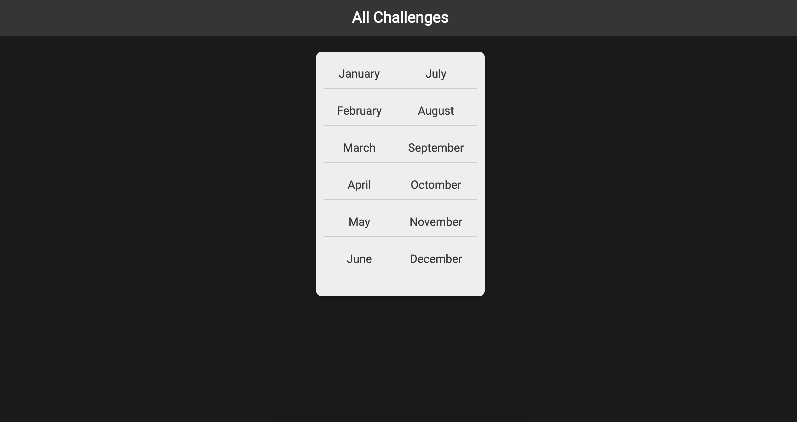

# Monthly challenge project

Learning `python3` and understanding basic `django` by creating project and following the Udemy course
[Python Django - The Practical Guide](https://www.udemy.com/course/python-django-the-practical-guide/)

## Development

To run the project on your machine run `python3 manage.py runserver`
The server is running on: http://127.0.0.1:8000/challenges/

## Notions covered

- Creating new project
- URLs and Views
- Dynamic path segments and captured values
- Path converters
- Redirects
- Reverse function and named URLs
- Adding templates
- Templates inheritance
- Partial template snippets
- 404 templates
- Adding static files
- Adding lgobal static files
- Adding css

## Screenshot

